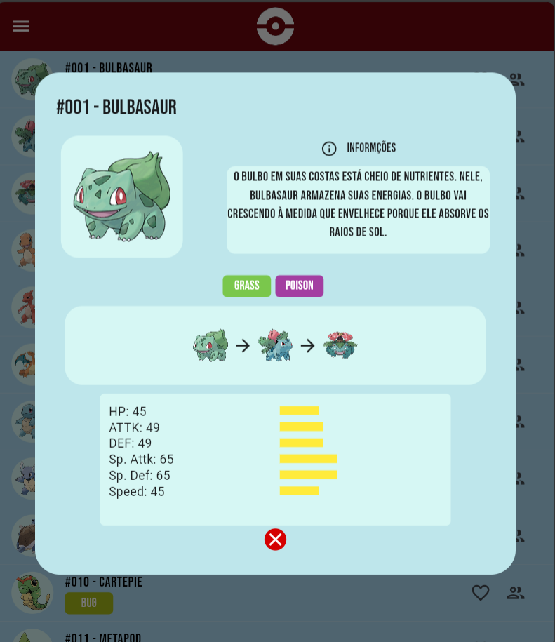
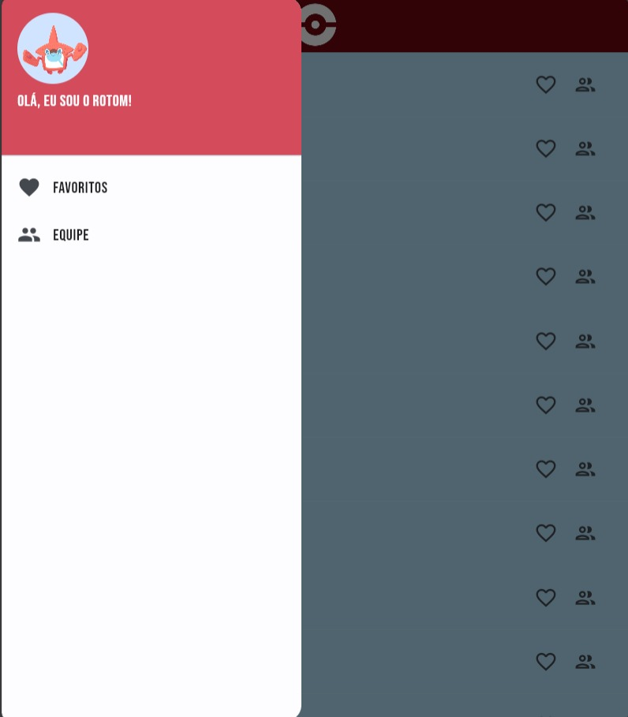
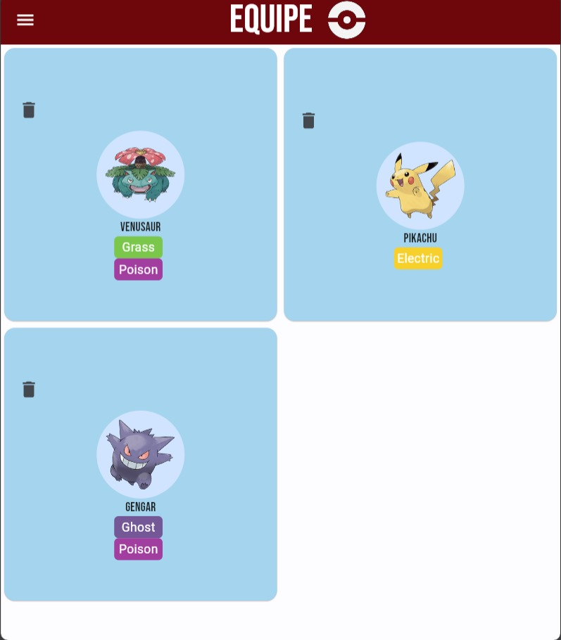
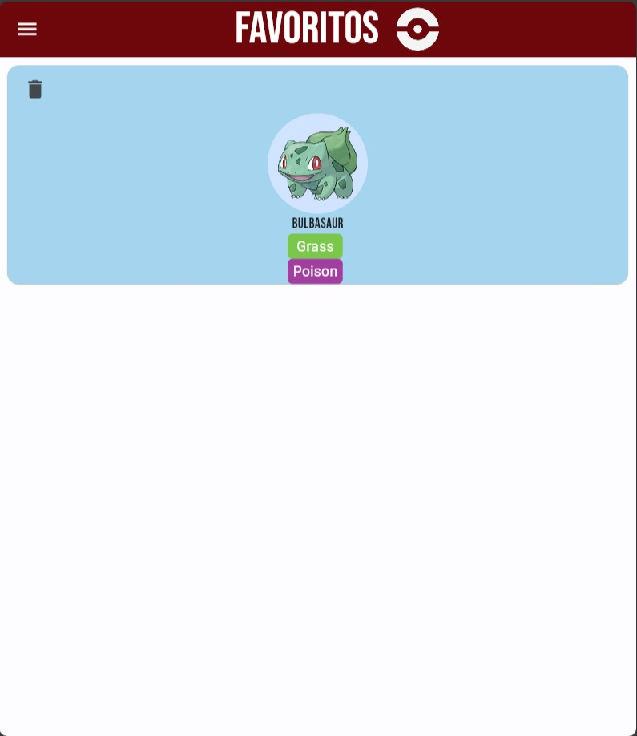

# Pokédex Flutter

Este é um aplicativo móvel da Pokédex desenvolvido em Flutter que permite aos usuários explorar e descobrir informações sobre diferentes Pokémon. Ele fornece detalhes sobre os Pokémon, como suas habilidades, tipos, estatísticas e muito mais.

## Funcionalidades Principais

- *Lista de Pokémon:* Visualize uma lista de Pokémon com imagens e nomes.
- *Detalhes do Pokémon:* Obtenha informações detalhadas sobre um Pokémon específico, incluindo habilidades, tipos e estatísticas.
- *Lista de Pokémons Favoritos*: Visualize a sua lista de Pokémons Favoritos.
- *Lista da sua equipe de Pokémons*: Visualize a sua equipe de Pokémons,
    

## Capturas de Tela

### Tela inicial com lista de Pokémon

---

### Detalhes de um Pokémon específico

---

### Menu Lateral

 

---

### Equipe de Pokémons

---

### Pokémons favoritos

## Como Usar

1. *Clone o Repositório:* Clone este repositório para sua máquina local.

    bash
    git clone https://github.com/Mamn11/pokedex_flutter.git
    cd pokedex_flutter
    

2. *Instalação:* Instale as dependências necessárias.

    bash
    flutter pub get
    

3. *Execução:* Inicie o aplicativo em um dispositivo ou emulador.

    bash
    flutter run
    

## Tecnologias Utilizadas

- *Flutter:* Framework para desenvolvimento de aplicativos móveis multiplataforma.
- *Dart:* Linguagem de programação usada com o Flutter.

## Autores
[Arthur Baratal](https://github.com/arthbarata)
[Mateus Maciel](https://github.com/Mamn11)
[Letícia Moreira](https://github.com/leticiaaamoreira)

faça uma divisão entre as imagens
